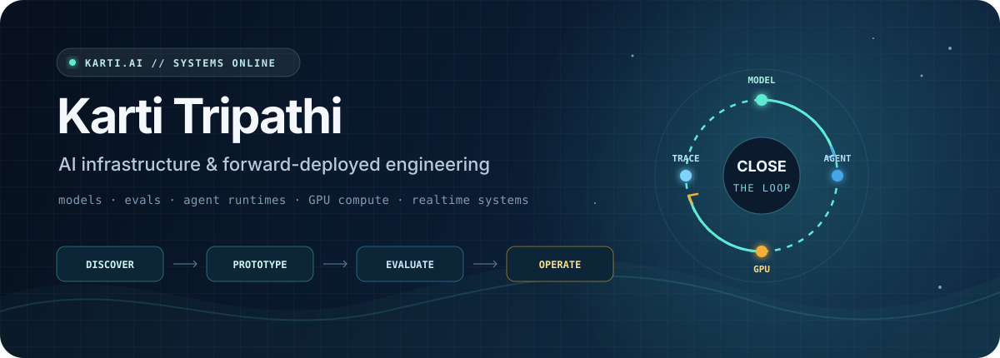

<p align="center">
  
</p>

<p align="center">
  <a href="https://karti.ai"></a>
  <a href="https://karti.ai/resume"></a>
  <a href="https://huggingface.co/KartiOS"></a>
  <a href="https://x.com/karti_ai"></a>
  <a href="https://www.linkedin.com/in/kartitripathi"></a>
</p>

## I build AI systems that survive contact with users.

I work across the whole deployment loop: technical discovery, POCs and evals, model training, agent runtimes, GPU infrastructure, realtime interfaces, and the production traces that make the next iteration better.

That range comes from operating across engineering, solutions, GTM, and production support—from Tesla and Labelbox through First Round and UW, into the systems I build today.

```text
customer problem → prototype → held-out eval → model / agent → governed runtime → production evidence
                           ↑                                             │
                           └──────────────── improve ─────────────────────┘
```

## Systems in the loop

### [Karti-Small-RSI-3B](https://huggingface.co/KartiOS/Karti-Small-RSI-3B)

A compact local-agent model family for reliable tool calling and offline agent workflows. The public model card includes the pinned foundation, training recipe, evaluation contract, and human-gated improvement loop; private weights and training rows stay private.

`PyTorch` `TRL` `LoRA / SFT` `Prime Intellect Verifiers` `GH200` `tool calling`

### [Lumbridge](https://lumbridgecorp.com)

Compute and evaluation foundations paired with private agent worlds: governed unified-memory AI nodes, verifier-driven environments, deterministic simulation, presence, and workspace systems.

`Rust` `Python` `TypeScript` `React` `three.js` `MCP` `DGX Spark / GB10`

### [115 Trading](https://115trading.com)

A personalized trading harness wrapped around one human trader: realtime market interfaces, Python/Rust execution, risk controls, a self-hosted data plane, MCP tools, and voice agents sharing one live operating picture.

`Python` `Rust` `React` `PostgreSQL` `WebSockets` `LiveKit` `MCP`

### [PodMan](https://podman.live)

An ambient voice-AI pair programmer that watches a shared engineering room and surfaces duplicated work, merge collisions, and missed handoffs. Built and shipped with a first-time hackathon team at the 2026 AI Engineer World’s Fair.

`LiveKit` `Gemma` `Modular MAX` `MongoDB` `DigitalOcean`

## Public engineering

| Project | What it proves | Core stack |
|:--|:--|:--|
| **[comma-controls-challenge](https://github.com/karti-ai/comma-controls-challenge)** | A causal realtime lateral controller built by measuring the simulator, fitting feedforward, and using the future plan as a zero-lag smoother. | Python · ONNX · controls |
| **[opencode-filter](https://github.com/karti-ai/opencode-filter)** | A fail-closed I/O boundary that detects and replaces secrets before agent traffic reaches a model. | TypeScript · HMAC · entropy detection |
| **[karti-code](https://github.com/karti-ai/karti-code)** | An agentic coding harness that composes specialized agents, lifecycle hooks, and private infrastructure tools. | TypeScript · OpenCode · MCP |
| **[search-mcp-server](https://github.com/karti-ai/search-mcp-server)** | Local-first web and code search for agents through SearXNG and Grep.app. | Go · SearXNG · Docker |
| **[gitea-mcp-server](https://github.com/karti-ai/gitea-mcp-server)** | Repository operations exposed as structured tools for agent workflows. | Go · Gitea · MCP |
| **[caddy-mcp-server](https://github.com/karti-ai/caddy-mcp-server)** | Safe reverse-proxy inspection and operations through an agent-facing control plane. | Go · Caddy · MCP |
| **[openclaw-mattermost-extension](https://github.com/karti-ai/openclaw-mattermost-extension)** | Agent orchestration connected to the place engineering teams already coordinate. | TypeScript · Mattermost · OpenClaw |
| **[AutoMagically](https://github.com/karti-ai/AutoMagically)** | Automated single-GPU research loops built from Karpathy's Auto Research work. | Python · PyTorch · experiment loops |

## Stack, by layer

```text
models & evals     PyTorch · TRL · LoRA/SFT · verifier-driven RL · dataset curation
agent systems      tool calling · MCP · LiveKit · OpenCode · Claude Code · Codex
runtime            vLLM · llama.cpp · CUDA · quantization · offline inference
systems            Rust · Python · TypeScript · Go · React · WebSockets · PostgreSQL
infrastructure     Docker · Kubernetes · Caddy · Tailscale · Proxmox · GitHub Actions
field work         discovery · solution architecture · POCs · integrations · production support
```

## Current focus

- Making local agents dependable enough to operate tools, not just narrate intentions.
- Building evaluation environments that produce useful evidence instead of leaderboard theater.
- Turning GPU nodes into governed, agent-operable infrastructure.
- Closing the loop between realtime human work, agent behavior, and the next training run.

<p align="center">
  <strong>Build the system. Measure the behavior. Improve the loop.</strong><br />
  <a href="https://karti.ai">karti.ai</a> ·
  <a href="https://karti.ai/resume">resume</a> ·
  <a href="mailto:kartitrip@gmail.com">email</a>
</p>
